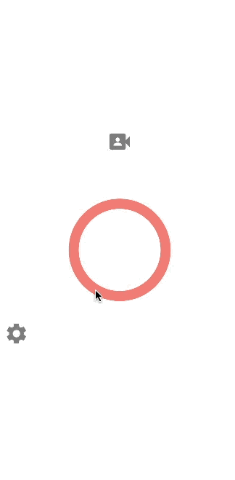
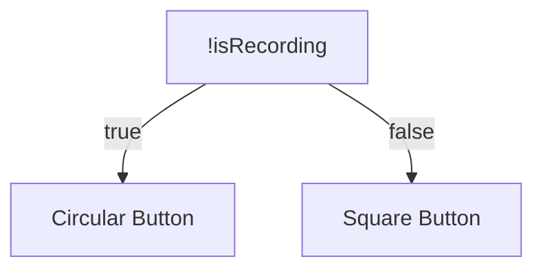

# THETA X Multi Bloc



This is a test of using multiple Blocs in a RICOH THETA application. This simple app will show multiple screens with one Bloc attached to each screen. 

## Multiple Blocs

```dart
return MultiBlocProvider(
      providers: [
        BlocProvider<CameraUseBloc>(create: (context) => CameraUseBloc()),
        BlocProvider<VideoSettingsBloc>(
            create: (context) => VideoSettingsBloc())
      ],
      child: MaterialApp())
```

In this application, each screen has its own Bloc to make the State more manageable. In the `main.dart` file, I used the `MultiBlocProvider` instead of the `BlocProvider` to list out all the Blocs. This enables me to use multiple Blocs throughout the application.

```dart
return BlocBuilder<VideoSettingsBloc, VideoSettingsState>(
      builder: (context, state) {
        return Scaffold(),
        })
```

For example, in the Video Settings Screen, the `Scaffold` is wrapped with a `BlocBuilder` that uses the `VideoSettingsBloc`. Each screen has its own specific Bloc.

## Ternary Operator

To switch the recording button into a square, I utilized the ternary operator from Dart. The ternary operator first checks if `isRecording` is false and sets the button to a circular button. Else, when `isRecording` is true, the button is set to a square button. 



```dart
!state.isRecording
                ? IconButton(
                    //circular shape
                    onPressed: () {
                      context.read<CameraUseBloc>().add(StartCaptureEvent());
                    },
                    iconSize: 200,
                    )
                : IconButton(
                    //square shape
                    onPressed: () {
                      context.read<CameraUseBloc>().add(StopCaptureEvent());
                    },)
```

In the `CameraUseBloc`, I set the variable `isRecording` to true when `StartCaptureEvent` is called and false when `StopCaptureEvent` is called. By changing the state of `isRecording`, the button will change its shape. 